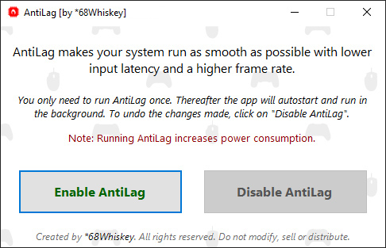

<h1 align="center">AntiLag</h1>

AntiLag makes your system run as smooth as possible with lower input latency and a higher frame rate.

  
  <!---->
  
  
  <!---->

 

  

 

## About
Does the following sound familiar? 

> *"Windows is running sluggish. Games don't feel smooth and frame rates are fluctuating a lot. High input lag puts you at a disadvantage and drives you nuts. Simply everything doesn't feel as performant as it should".* 

I had the same issues and after lots of research and trial & error I packed the most effective settings in one little easy to use tool. With AntiLag my computer runs perfectly smooth, for games and daily work. Try it and see for yourself. 

:fire: AntiLag to the rescue!  
:point_right: Simple to use. Run AntiLag once and you're good to go  
:point_right: Say goodbye to stutters!  
:point_right: Lowers DPC Latency  
:point_right: Keeps Timer Resolution constant  
:point_right: Custom Power Plan for optimal performance  
:point_right: Undo changes in one click  
:point_right: No files or software will be installed  
:point_right: No internet connection required  
:point_right: Also works on (gaming) laptops  
:point_right: Nvidia, AMD, Intel supported  
 

Amongst the system optimizations, your active power plan is duplicated and modified for optimal performance. If you disable AntiLag, your power plan and settings are restored. 

Here is a screenshot of [DPC Latency Checker](https://web.archive.org/web/20160317125429/https://www.thesycon.de/eng/latency_check.shtml) that shows [DPC](https://en.wikipedia.org/wiki/Deferred_Procedure_Call) Latency (lower is better) **before** (yellow) and **after** (green) enabling AntiLag. You can also use [LatencyMon](https://www.resplendence.com/latencymon) which analyses your system and generates a report with insightful performance data.

  

 

## Instructions
**Enable AntiLag**
1. Download the latest [AntiLag](https://github.com/AmbitiousPilots/AntiLag/releases/latest/download/68WAntiLagApp.exe) release and place it anywhere you like (e.g. on your desktop). 
2. Run AntiLag and click on "Enable AntiLag". 
3. Your computer will be restarted for the changes to take effect. 
4. Once enabled, make sure the AntiLag file remains in the same location. If you move it, follow step 2 again. 
5. That's it. Enjoy! 

 

**Disable AntiLag**
1. Run AntiLag and click on "Disable AntiLag". 
2. Your computer will be restarted for the changes to take effect. 
3. Now all modifications are rolled back. 

 

**How to prevent autostart**
 
*In order to keep the timer resolution on a constant 0.5ms (else it runs a value up to 15.625ms), AntiLag needs to run in the background. However, if you don't mind the timer resolution, you can disable the autostart entry for AntiLag as follows (this won't affect the other optimizations, but you likely lose some FPS and increase input lag):* 
1. Launch the task manager (right click on taskbar, or press ctrl+alt+del). 
2. Switch to the "Startup" tab (click on "more details" in case you don't see any tabs). 
3. Locate "68WAntiLagApp" and click on disable. 
4. AntiLag won't automatically run on startup from now on. 

 

***Note:** Running AntiLag increases power consumption. Make sure [.NET Framework 4.7.2](https://dotnet.microsoft.com/download/dotnet-framework/thank-you/net472-offline-installer) or higher is installed as it's required to run AntiLag.*
  

## Status & Disclaimer
Please note that this project is in ALPHA phase. The software is provided "as is" without any warranty of any kind. Use at your own risk. For discussion, questions, remarks, bug reports, feature requests, head on over to [issues](https://github.com/AmbitiousPilots/AntiLag/issues).
  

## License
AntiLag is provided under the [Creative Commons BY-NC-ND 4.0 License](https://creativecommons.org/licenses/by-nc-nd/4.0/).
